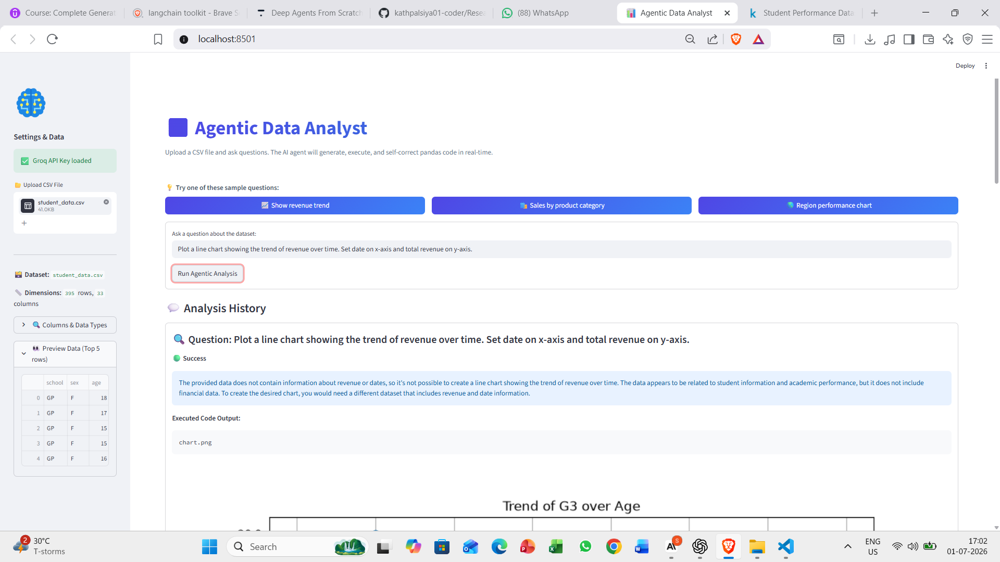
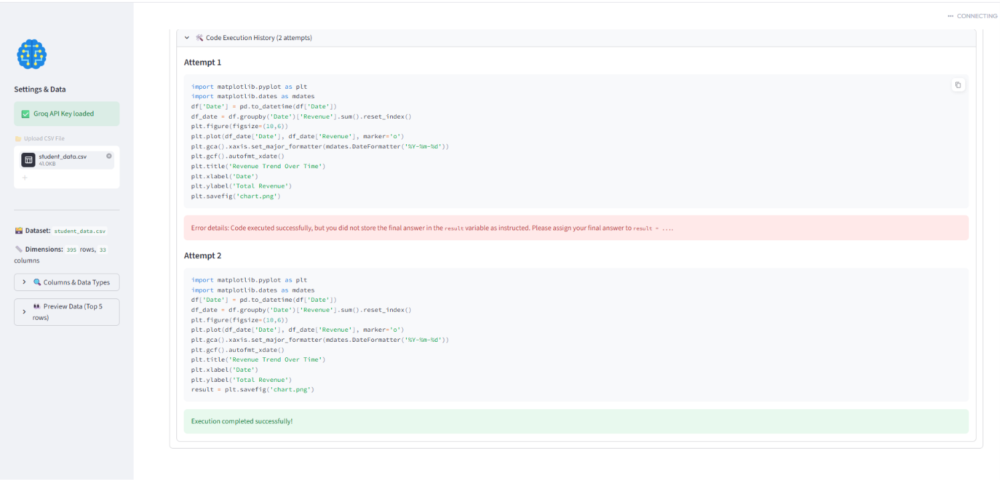

# 🤖 Agentic Data Analyst

An AI-powered data analyst that lets anyone analyze CSV files 
using plain English — no coding, no pandas, no SQL required.
Upload your data, ask your question, and let the AI agent 
handle everything else.

---

## 🎯 The Problem It Solves

Most people have data but can't analyze it because they don't 
know pandas or SQL. This project removes that barrier completely 
— the AI agent writes the code, runs it, fixes its own mistakes, 
and explains the answer in simple language.

---

## 📸 Demo

### The App Interface

> Upload any CSV, preview your data instantly, and ask 
> questions in plain English.

### The Agentic Self-Correction Loop in Action

> **This is the core of the project.** Attempt 1 wrote the 
> code correctly but forgot to store the answer in the 
> `result` variable. The agent caught its own mistake, 
> fixed the code in Attempt 2, and executed successfully — 
> completely autonomously. No human intervention.

---

## ✨ Key Features

- 📁 Upload any CSV file and preview it instantly
- 💬 Ask questions in plain English — no coding needed
- 🧠 AI agent writes pandas code to answer your question
- 🔄 Self-corrects on errors automatically (up to 3 retries)
- 📊 Generates charts automatically when needed
- 📝 Explains results in simple human language
- 🔍 Full transparency — see every code attempt the agent made
- 📋 Shows dataset dimensions, columns, and data types instantly

---

## 🏗️ How It Works
User uploads CSV file
↓
Agent reads data structure
(column names, data types, sample rows)
↓
User asks question in plain English
↓
LLM generates pandas code to answer it
↓
Code gets executed on real data
↓
Did it work?
✅ Yes → Explain result in plain English + show chart
❌ No  → Agent reads error, fixes code, retries
(maximum 3 attempts)

---

## 🧠 The Agentic Self-Correction Loop

This is what makes this project truly **agentic** — not just 
a chatbot.

The agent follows the **ReAct pattern**
(Reason + Act + Observe + Reflect):

| Step | What Happens |
|------|-------------|
| 🧠 Reason | Understands the question + reads data structure |
| ⚡ Act | Writes and executes pandas code |
| 👁️ Observe | Reads the output or error message |
| 🔄 Reflect | If error → fixes the code and retries |

The agent doesn't just generate an answer once.
It observes its own failure, reasons about what went wrong,
rewrites the code, and tries again — just like a real 
data analyst debugging their own code.

---

## 🛠️ Tech Stack

| Component | Technology |
|-----------|------------|
| Agent Orchestration | LangGraph |
| LLM | Groq (llama-3.3-70b-versatile) |
| Data Processing | Pandas |
| Visualization | Matplotlib |
| Frontend | Streamlit |
| API Management | Python-dotenv |

---

## 📁 Project Structure
agentic_analyst/
├── app.py           → Streamlit frontend
├── agent.py         → LangGraph self-correction agent
├── requirements.txt → Dependencies
├── .env             → API keys (not pushed to GitHub)
├── .gitignore
├── demo1.png        → App interface screenshot
└── demo2.png        → Self-correction loop screenshot

---

## 🚀 Setup & Installation

**1. Clone the repository**

git clone https://github.com/kathpalsiya01-coder/Agentic_DataAnalyst.git
cd Agentic_DataAnalyst

**2. Create a virtual environment**

conda create -n agentic_analyst python=3.10
conda activate agentic_analyst

**3. Install dependencies**

pip install -r requirements.txt

**4. Add your Groq API key**

Create a `.env` file in the project root:
GROQ_API_KEY=your_groq_api_key_here
Get your free API key at: https://console.groq.com

**5. Run the app**

streamlit run app.py

Open your browser at `http://localhost:8501`

---

## 💡 Example Questions to Ask

Once you upload a CSV, try asking:

- *"What are the basic statistics of this dataset?"*
- *"Which category appears most frequently?"*
- *"Show me a bar chart of the top 10 values"*
- *"What is the average value grouped by category?"*
- *"Which column has the most missing values?"*
- *"Who are the top 5 entries by score?"*
- *"What percentage of rows meet this condition?"*

---

## 🔬 Research Papers That Inspired This

- **ReAct: Synergizing Reasoning and Acting in Language Models**
  Yao et al., 2022 — the core agentic pattern used in this project

- **Attention Is All You Need**
  Vaswani et al., 2017 — transformer architecture powering the LLM

---

## 🔮 Future Improvements

- SQL database support for larger datasets
- Multi-CSV joining and cross-dataset analysis
- LangSmith tracing for production observability
- Docker containerization for cloud deployment
- Voice input for asking questions

---

## 👩‍💻 About

Built by **Siya Kathal** — B.Tech student passionate about
Generative AI and Agentic AI systems.

🔗 GitHub: [@kathpalsiya01-coder](https://github.com/kathpalsiya01-coder)
💼 LinkedIn: [https://www.linkedin.com/in/siya-kathpal-640131333/]

---

⭐ If you found this useful, please star the repo!
